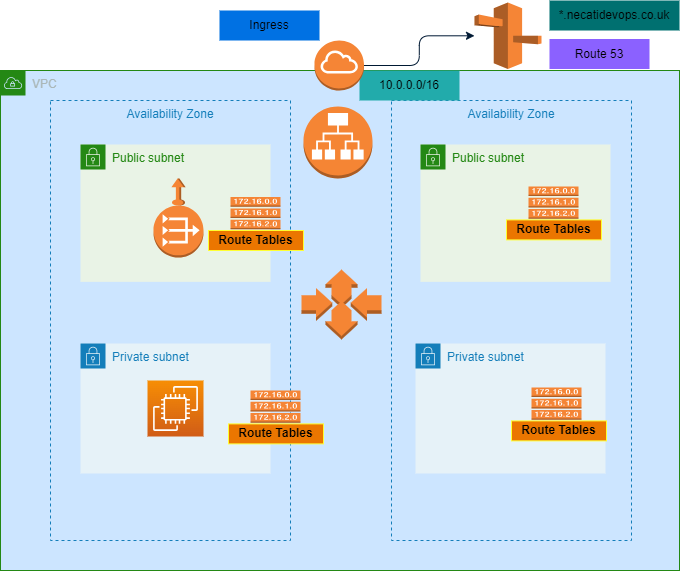

# eks cluster with autoscaler and loadbalancer

## Usage
Firstly, create eks cluster to test applications
 
```console
$ git checkout feature/k8s

$ cd infra/01-eks-basic

$ terraform init

$ terraform plan

$ terraform apply -auto-approve

```

If you want to use ingress for your application, run terraform commands in the 02-loadbalancer-externalDNS-install folder.

connect to cluster to check the node

```console
$ export AWS_PROFILE = "terraform"

$ aws eks --region eu-west-2 update-kubeconfig --name pharm-dev-demo1

```
## EKS Cluster with DNS
